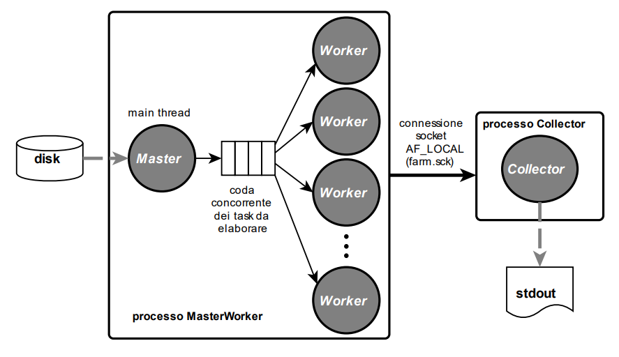
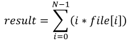

> **Progetto** **SOL** **--** **Corso** **A** **e** **B** **--**
> **a.a.** **23/24**
>
> **Docente** **Massimo** **Torquati**
>
> **massimo.torquati@unipi.it**

Si chiede di realizzare un programma C multi-processo e multi-threaded,
denominato ***farm2***, che implementa lo schema di comunicazione tra
processi e thread mostrato in Figura.

  

***farm2*** è un programma composto da due processi, il primo denominato
*MasterWorker* ed il secondo denominato *Collector*. *MasterWorker*, è
un processo multi-threaded composto da un thread *Master* e da '*n*'
thread *Worker*. **Il numero di thread Worker può variare dinamicamente nel corso dell'esecuzione.**
Il valore iniziale del numero dei Worker viene settatto utilizzando
l'argomento opzionale '-n' (vedere nel seguito). Il programma prende
come argomenti una lista (eventualmente vuota se viene passata l'opzione
'-d') di file binari contenenti numeri interi lunghi ed un certo numero
di argomenti opzionali (le opzioni sono '-n', '-q', '-t', '-d'). Il
processo *Collector* viene generato dal processo *MasterWorker*. I due
processi comunicano **esclusivamente** attraverso una o più connessioni
socket AF_LOCAL (AF_UNIX). Il processo *Collector* fa da processo server
per le connessioni socket. Il socket file, denominato "***farm2.sck***"
ed associato alla/alle connessione AF_LOCAL, deve essere creato
all'interno della directory del progetto e deve essere cancellato alla
terminazione del programma.

Il processo *MasterWorker* legge gli argomenti passati alla funzione
*main* uno alla volta, verificando che siano file regolari. Se viene
passata l'opzione '-d' che prevedecome argomento un nome di directory,
viene navigata la directory passata come argomento e considerati tutti i
file e le directory al suo interno.

Il nome del generico file di input (unitamente ad altre eventuali
informazioni) viene inviato ad uno dei thread *Worker* del pool tramite
una coda concorrente condivisa (denominata "coda concorrente dei task da
elaborare" in Figura 1). Il generico thread *Worker* si occupa di
leggere dal disco il contenuto dell'intero file il cui nome ha ricevuto
in input, e di effettuare un calcolo sugli elementi letti. Il risultato
del calcolo, unitamente al nome del file, viene quindi inviato dal
*Worker* al processo *Collector* tramite la/le connessione/i socket
precedentemente stabilita/e. Il processo *Collector* attende di ricevere
tutti i risultati dai *Worker*, ed al termine della sua esecuzione,
stamperà **sempre** i valori ricevuti sullo standard output, ordinando
la stampa, in modo crescente rispetto al risultato
(risultato1\<=risultato2\<=risultato3, ...):

risultato1 filepath1
risultato2 filepath2
risultato3 filepath3

La stampa dei risultati da parte del *Collector* avviene più di una
volta se il tempo di esecuzione del *Collector* è maggiore ad un
secondo. Infatti, il processo *Collector* stampa in modo ordinato sullo
standard output i risultati parziali ricevuti fino a quel momento
**dopo ogni secondo di esecuzione** (al termine, prima
di uscire, effettuerà comunque la stampa di tutti i risultati ottenuti).

Il calcolo che deve essere effettuato su ogni file è il seguente:

  

dove N è il numero di interi lunghi (long) contenuti nel file, e
*result* è l'intero lungo che dovrà essere inviato al *Collector*. Ad
esempio, supponendo che il file "mydir/*fileX.dat"* passato in input
come argomento del *main* abbia dimensione 24 bytes, con il seguente
contenuto (si ricorda che gli interi lunghi -- *long* -- sono codificati
con 8 bytes in sistemi Linux a 64bit):

3 2 4

il risultato calcolato dal *Worker* sarà:

N=3, 𝑟𝑒𝑠𝑢𝑙𝑡 = ∑𝑖=0 \[(𝑖 ∗ 𝑓𝑖𝑙𝑒\[𝑖\]) \] = (0 ∗ 3 + 1 ∗ 2 + 2 ∗ 4) = 10,
quindi il processo Collector stamperà:

> 10 mydir/fileX.dat

Gli argomenti che opzionalmente possono essere passati al processo
*MasterWorker* sono i seguenti:

> • -n \<nthread\> specifica il numero di thread *Worker* del processo
> *MasterWorker* (valore di default 4)
>
> • -q \<qlen\> specifica la lunghezza della coda concorrente tra il
> thread *Master* ed i thread *Worker* (valore di default 8)
>
> • -d \<directory-name\> specifica una directory in cui sono contenuti
> file binari ed eventualmente altre directory contenente file binari
> qualora l'opzione venga ripetuta più volte; i file binari dovranno
> essere utilizzati come file di input per il calcolo;
>
> • -t \<delay\> specifica un tempo **in millisecondi** che
> intercorre tra l'inserimento di due task consecutivi nella coda
> concorrente da parte del thread *Master* (valore di default 0). Usare
> la chiamata di libreria *usleep* o la system call *nanosleep* per
> implementare il ritardo.

Il processo *MasterWorker* deve gestire i segnali **SIGHUP,**
**SIGINT,** **SIGQUIT,** **SIGTERM,** **SIGUSR1** **e** **SIGUSR2**.
Invece, il processo *Collector* deve mascherare tali segnali. Il segnale
SIGPIPE deve essere ignorato da entrambi i processi. Alla ricezione dei
segnali SIGHUP, SIGINT, SIGQUIT e SIGTERM il processo *MasterWorker*
deve attendere che i *Worker* completino i task eventualmente presenti
nella coda dei task da elaborare, non leggendo piùeventuali altrifile in
input; quindi, deve terminaredopoaveratteso la terminazione dei
*Workers* e del processo *Collector.* Alla ricezione del segnale SIGUSR1
il processo *MasterWorker* incrementa di una unità il numero di thread
*Worker* nel pool (cioè viene creato un nuovo thread del pool),
mentrealla ricezione del segnaleSIGUSR2 *MasterWorker* decrementa di una
unità il numero di thread *Worker* nel pool (cioè uno dei thread del
pool termina). Prima di terminare, il processo MasterWorker, scrive
(eventualmente sovrascrivendolo) nel file '**nworkeratexit.txt**' il
numero di thread *Worker* presenti nel pool all'uscita, e cancella il
socket file. Il processo *MasterWorker* e *Collector* non si inviano
l'un l'altro segnali in modo esplicito.

**Note**

\- La dimensione dei file in input non è limitata ad un valore massimo.
Si supponga che la lunghezza del nome dei file (compreso il pathname)
sia al massimo 255 caratteri.

\- Il numero di file in input non è limitato ad un valore massimo.

\- Il numero minimo di thread *Worker* nel pool è 1, non si deve invece
assumere un limite superiore.

